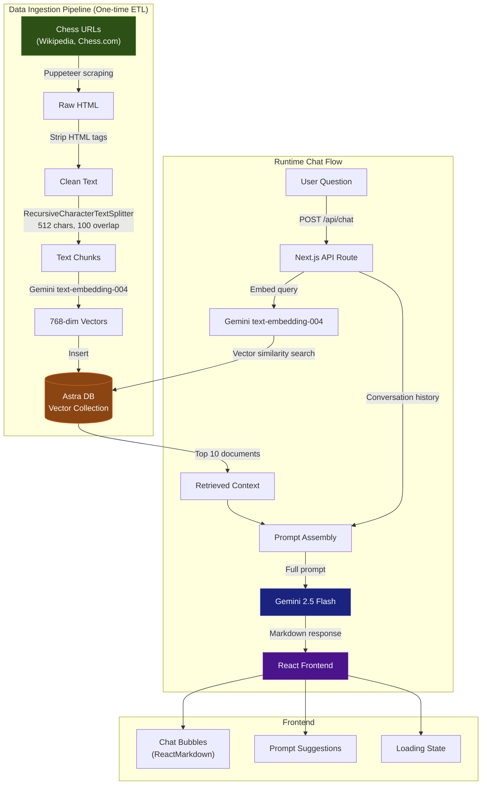
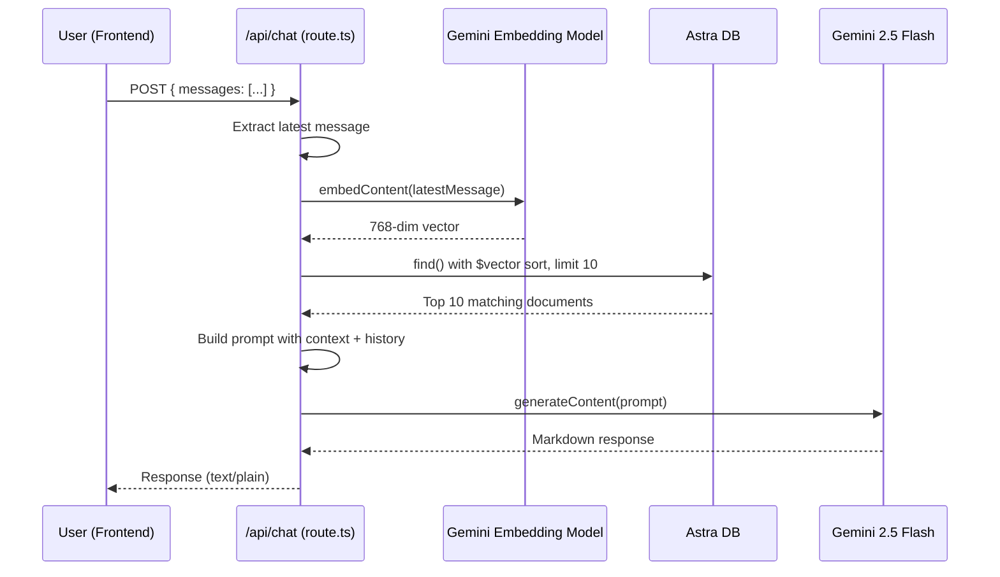

# ChessNexus — Complete Codebase Deep Dive (Interview Ready)

> [!IMPORTANT]
> This document covers **every file, every technology, every design decision, and every logic flow** in the ChessNexus project. It is designed to prepare you for technical interviews where you need to explain what you built, why you chose each technology, and how the system works end-to-end.
2
---

## 📋 Table of Contents

1. [Project Overview](#1-project-overview)
2. [Architecture Diagram](#2-architecture-diagram)
3. [Complete Tech Stack — What & Why](#3-complete-tech-stack--what--why)
4. [Project Structure](#4-project-structure)
5. [Data Ingestion Pipeline (ETL Script)](#5-data-ingestion-pipeline-etl-script)
6. [Backend API — RAG Chat Route](#6-backend-api--rag-chat-route)
7. [Frontend — React UI](#7-frontend--react-ui)
8. [Component Breakdown](#8-component-breakdown)
9. [Styling & Design System](#9-styling--design-system)
10. [Configuration & Environment](#10-configuration--environment)
11. [Key Design Decisions & Trade-offs](#11-key-design-decisions--trade-offs)
12. [Common Interview Q&A](#12-common-interview-qa)

---

## 1. Project Overview

**ChessNexus** is an **AI-powered chess assistant chatbot** built using the **RAG (Retrieval-Augmented Generation)** pattern. It answers chess-related questions by:

1. **Scraping** chess knowledge from Wikipedia and chess sites
2. **Embedding** that knowledge into vector representations using Google's Gemini embedding model
3. **Storing** those embeddings in a cloud-hosted vector database (DataStax Astra DB)
4. **Retrieving** the most relevant context at query time using vector similarity search
5. **Generating** expert-level answers using the Gemini LLM, grounded in the retrieved context

**In one sentence for interviews:** *"ChessNexus is a RAG-based AI chatbot that scrapes chess knowledge, stores it as vector embeddings in Astra DB, and at query time retrieves the most relevant context to generate accurate, grounded answers using Gemini."*

---

## 2. Architecture Diagram



---

## 3. Complete Tech Stack — What & Why

### 3.1 Framework: Next.js 15.3.6 (App Router)

| Aspect | Detail |
|--------|--------|
| **What** | Full-stack React framework with server-side rendering, API routes, and file-based routing |
| **Why chosen** | Provides both frontend and backend in a single project. The App Router allows colocating API routes ([app/api/chat/route.ts](file:///c:/Users/archi/Desktop/chessgpt/app/api/chat/route.ts)) with pages. Eliminates the need for a separate Express backend |
| **Key feature used** | **Route Handlers** — the [app/api/chat/route.ts](file:///c:/Users/archi/Desktop/chessgpt/app/api/chat/route.ts) file automatically becomes a `POST /api/chat` endpoint without any extra configuration |
| **Turbopack** | Dev script uses `next dev --turbopack` for faster Hot Module Replacement during development |

**Interview talking point:** *"I chose Next.js because it gave me a full-stack solution in one project. The App Router's convention-based routing meant I could create an API endpoint just by placing a [route.ts](file:///c:/Users/archi/Desktop/chessgpt/app/api/chat/route.ts) file in the right directory — no Express setup, no separate server."*

### 3.2 Language: TypeScript 5

| Aspect | Detail |
|--------|--------|
| **What** | Typed superset of JavaScript |
| **Why chosen** | Catches bugs at compile time, provides better IDE support, and makes the codebase more maintainable. Explicit types for message shapes ([Message](file:///c:/Users/archi/Desktop/chessgpt/app/page.tsx#11-16) type), API responses, and component props |
| **Key config** | [tsconfig.json](file:///c:/Users/archi/Desktop/chessgpt/tsconfig.json) targets ES2017, uses `bundler` module resolution (optimized for Next.js), strict mode enabled |

### 3.3 AI/LLM: Google GenAI SDK (`@google/genai`)

| Aspect | Detail |
|--------|--------|
| **What** | Google's unified generative AI SDK — the replacement for the deprecated `@google/generative-ai` package |
| **Why chosen** | Single SDK provides both the **embedding model** (`gemini-embedding-001`) for vectorizing text AND the **generation model** (`gemini-2.5-flash`) for producing answers. The new SDK uses `v1beta` correctly for all supported models |
| **Models used** | `gemini-embedding-001` → produces 3072-dimensional vectors; `gemini-2.5-flash` → fast, capable text generation |
| **Migration note** | The old `@google/generative-ai` SDK was deprecated and EOL. The new `@google/genai` SDK uses a flat API: `ai.models.embedContent()` and `ai.models.generateContent()` instead of `genAI.getGenerativeModel(...).method()` |

**Interview talking point:** *"I migrated from the deprecated `@google/generative-ai` SDK to the new unified `@google/genai` SDK. The old SDK defaulted to the `v1beta` API which caused 404 errors for `text-embedding-004`. I switched to `gemini-embedding-001` which is supported on `v1beta` and is the recommended replacement, eliminating any API version issues entirely."*

### 3.4 Vector Database: DataStax Astra DB (`@datastax/astra-db-ts` v1.5.0)

| Aspect | Detail |
|--------|--------|
| **What** | Cloud-native, serverless vector database built on Apache Cassandra |
| **Why chosen** | Purpose-built for vector similarity search. Serverless = no infrastructure management. Provides a simple insert/query API with built-in vector indexing. Supports `dot_product`, `cosine`, and `euclidean` similarity metrics |
| **How used** | Stores text chunks alongside their 3072-dim vector embeddings. At query time, performs ANN (Approximate Nearest Neighbor) search to find the top 10 most relevant documents |

**Interview talking point:** *"I chose Astra DB because it's serverless and specifically designed for vector workloads. I didn't need to manage infrastructure or configure indexing strategies — it handles vector similarity search natively."*

### 3.5 ETL / Data Processing

| Library | Purpose | Why |
|---------|---------|-----|
| **LangChain** (`langchain` v0.3.29) | `RecursiveCharacterTextSplitter` for chunking text | Industry-standard text splitting with configurable chunk size and overlap. Recursive splitting ensures chunks break at natural boundaries (paragraphs → sentences → words) |
| **LangChain Community** (`@langchain/community` v0.3.48) | `PuppeteerWebBaseLoader` for web scraping | Provides a high-level loader interface that integrates Puppeteer scraping into the LangChain document pipeline |
| **Puppeteer** (`puppeteer` v24.12.1) | Headless Chrome browser automation | Needed to scrape JavaScript-rendered pages (Wikipedia uses dynamic content). Simpler HTTP fetchers like `axios` would miss dynamically loaded content |

### 3.6 Frontend Libraries

| Library | Purpose | Why |
|---------|---------|-----|
| **React 19** | Component-based UI | Latest version with improved rendering. Used with `"use client"` directive for client-side interactivity |
| **react-markdown** (v10.1.0) | Render Markdown as React components | The LLM returns Markdown-formatted text (headings, lists, tables, code blocks). This library safely renders it as styled HTML without using `dangerouslySetInnerHTML` |
| **lucide-react** (v0.559.0) | Icon library | Lightweight, tree-shakeable icon set (installed but usage is optional/extendable) |
| **next/image** | Optimized image loading | Next.js built-in component for automatic image optimization, lazy loading, and responsive sizing |

### 3.7 Dev Dependencies

| Library | Purpose |
|---------|---------|
| **ts-node** (v10.9.2) | Runs TypeScript directly (used for the `npm run seed` script without a compile step) |
| **@types/node, @types/react, @types/react-dom** | TypeScript type definitions for Node.js and React |

---

## 4. Project Structure

```
chessgpt/
├── app/                          # Next.js App Router directory
│   ├── api/
│   │   └── chat/
│   │       └── route.ts          # 🔥 POST /api/chat — RAG endpoint (core backend logic)
│   ├── components/
│   │   ├── Bubble.tsx            # Chat message bubble (renders Markdown)
│   │   ├── LoadingBubble.tsx     # Three-dot loading animation
│   │   ├── PromptSuggestionButton.tsx  # Individual clickable prompt button
│   │   └── PromptSuggestionRow.tsx     # Row of suggested prompts
│   ├── global.css                # 🎨 All styling (509 lines, chess-themed dark UI)
│   ├── layout.tsx                # Root layout with metadata (title, favicon)
│   └── page.tsx                  # 🔥 Main chat page (client component, state management)
├── scripts/
│   └── loadDb.ts                 # 🔥 ETL script — scrape, chunk, embed, store
├── public/
│   └── assets/
│       └── logo-chess.png        # Logo image
├── .env                          # Environment variables (API keys, DB credentials)
├── next.config.ts                # Next.js configuration (React strict mode)
├── tsconfig.json                 # TypeScript configuration
├── package.json                  # Dependencies and scripts
└── README.md                     # Project documentation
```

> [!TIP]
> **Files marked with 🔥 are the three critical files** that contain all the core logic. The rest are supporting configuration and UI components.

---

## 5. Data Ingestion Pipeline (ETL Script)

**File:** [loadDb.ts](file:///c:/Users/archi/Desktop/chessgpt/scripts/loadDb.ts)

This is a **one-time setup script** (`npm run seed`) that populates the vector database with chess knowledge. It implements a classic **ETL (Extract, Transform, Load)** pipeline.

### 5.1 Data Sources

11 curated chess URLs are defined:

```typescript
const f1Data = [
  'https://en.wikipedia.org/wiki/Chess_opening',
  'https://en.wikibooks.org/wiki/Chess_Opening_Theory',
  'https://en.wikipedia.org/wiki/List_of_chess_players',
  'https://en.wikipedia.org/wiki/World_Chess_Championship',
  'https://simple.wikipedia.org/wiki/List_of_World_Chess_Champions',
  'https://en.wikipedia.org/wiki/Chess',
  'https://en.wikipedia.org/wiki/List_of_chess_games',
  'https://www.chess.com/article/view/the-best-chess-games-of-all-time',
  'https://www.wikihow.com/Play-Chess',
  'https://en.wikipedia.org/wiki/List_of_chess_players_by_peak_FIDE_rating',
  'https://en.wikipedia.org/wiki/Comparison_of_top_chess_players_throughout_history',
];
```

**Why these sources:** They cover the breadth of chess knowledge — openings, players, championships, rules, ratings, and famous games.

### 5.2 Step-by-Step Logic

#### Step 1: Create Collection
```typescript
const createCollection = async (similarityMetric: SimilarityMetric = 'dot_product') => {
  const res = await db.createCollection(ASTRA_DB_COLLECTION!, {
    vector: {
      dimension: 3072,     // Must match gemini-embedding-001 output dimension
      metric: similarityMetric,  // dot_product for normalized vectors
    },
  });
};
```

**Why 3072 dimensions?** The `gemini-embedding-001` model produces 3072-dimensional vectors. The collection must be configured to match — a mismatch causes insert/query failures.

**Why dot_product?** For normalized vectors (which Gemini produces), dot product is equivalent to cosine similarity but computationally faster.

#### Step 2: Scrape Pages (Extract)
```typescript
const scrapePage = async (url: string) => {
  const loader = new PuppeteerWebBaseLoader(url, {
    launchOptions: { headless: true },
    gotoOptions: { waitUntil: 'domcontentloaded' },
    evaluate: async (page, browser) => {
      const result = await page.evaluate(() => document.body.innerHTML);
      await browser.close();
      return result;
    },
  });
  return (await loader.scrape())?.replace(/<[^>]*>?/gm, '');
};
```

**Logic breakdown:**
1. **Puppeteer** launches a headless Chrome browser (no visible UI)
2. Navigates to the URL and waits for `domcontentloaded` (faster than `networkidle0`)
3. Extracts `document.body.innerHTML` — the full page content
4. **Strips all HTML tags** with regex `/<[^>]*>?/gm` — leaving only clean text
5. Closes the browser to free resources

**Why Puppeteer instead of simple HTTP fetch?** Wikipedia and similar sites use JavaScript rendering. Puppeteer renders the page in a real browser engine, capturing dynamically loaded content that a simple `fetch()` would miss.

#### Step 3: Chunk Text (Transform)
```typescript
const splitter = new RecursiveCharacterTextSplitter({
  chunkSize: 512,
  chunkOverlap: 100,
});
const chunks = await splitter.splitText(content);
```

**Why chunking is necessary:** LLMs have context limits. Embedding an entire Wikipedia page as one vector would lose granularity. Smaller chunks allow the vector search to find the most specific, relevant passage.

**Why 512 character chunks?** A balance between:
- Too small (100–200 chars) → loses context, each chunk is meaningless alone
- Too large (2000+ chars) → the embedding averages out the meaning, reducing retrieval precision

**Why 100 character overlap?** Prevents information loss at chunk boundaries. If a key sentence spans two chunks, the overlap ensures it appears fully in at least one chunk.

**How `RecursiveCharacterTextSplitter` works:** It tries splitting by:
1. Double newline (`\n\n`) — paragraph boundaries
2. Single newline (`\n`) — line breaks
3. Spaces — word boundaries
4. Characters — last resort

This hierarchy preserves semantic coherence by splitting at the most natural boundary first.

#### Step 4: Embed & Store (Load)
```typescript
for await (const chunk of chunks) {
  const vector = await embedWithRetry(chunk);

  await collection.insertOne({
    $vector: vector,   // 3072-dimensional float array
    text: chunk,       // Original text (for retrieval later)
  });

  await sleep(200); // throttle: 200ms between requests
}
```

**Logic:**
1. Each text chunk is passed to `embedWithRetry()` which calls `gemini-embedding-001` via the `@google/genai` SDK
2. The model returns a 3072-dimensional vector — a numerical representation of the chunk's semantic meaning
3. Both the vector AND the original text are stored together in Astra DB
4. The `$vector` field is automatically indexed by Astra DB for similarity search

**Why `embedWithRetry()`?** The free tier of `gemini-embedding-001` is limited to 1,000 requests/day. If the limit is hit, the function reads the `retryDelay` from the 429 error response and waits automatically before retrying (up to 5 attempts with exponential backoff). A 200ms `sleep()` between inserts further prevents burst rate limiting.

**Why store the original text alongside the vector?** The vector is only for search. When we find relevant documents, we need the actual text to include in the LLM prompt.

#### Execution Flow
```typescript
createCollection().then(() => loadSampleData());
```
Sequential: first create the collection, then populate it. This ensures the collection exists before attempting inserts.

---

## 6. Backend API — RAG Chat Route

**File:** [route.ts](file:///c:/Users/archi/Desktop/chessgpt/app/api/chat/route.ts)

This is the **heart of the application** — the RAG pipeline that turns user questions into context-aware answers.

### 6.1 How It Becomes an API Endpoint

In Next.js App Router, any file named [route.ts](file:///c:/Users/archi/Desktop/chessgpt/app/api/chat/route.ts) inside `app/api/...` automatically becomes an API endpoint. The directory path maps to the URL:
- `app/api/chat/route.ts` → `POST /api/chat`

The exported function name (`POST`) determines the HTTP method it handles.

### 6.2 Complete Request Flow



### 6.3 Step-by-Step Code Walkthrough

#### Step 1: Extract User Message
```typescript
const { messages } = await req.json();
const latestMessage = messages[messages.length - 1]?.content;
```
The frontend sends the **entire conversation history**. We extract the **latest message** to embed and search for relevant context.

**Why send all messages?** The full history is used later in the prompt to give the LLM conversation context (multi-turn awareness).

#### Step 2: Embed the Query
```typescript
const embeddingResponse = await ai.models.embedContent({
  model: 'gemini-embedding-001',
  contents: latestMessage,
});
const embeddingValues = embeddingResponse.embeddings?.[0]?.values ?? [];
```
The user's question is converted to a 3072-dimensional vector using the **same embedding model** used during data ingestion.

**Critical insight for interviews:** The same model MUST be used for both ingestion and querying. If different models were used, the vectors would exist in different embedding spaces and similarity search would be meaningless.

#### Step 3: Vector Similarity Search (Retrieval)
```typescript
const collection = await db.collection(ASTRA_DB_COLLECTION!);
const cursor = collection.find({}, {
  sort: { $vector: embeddingValues },
  limit: 10,
});
const documents = await cursor.toArray();
const docsMap = documents?.map((doc) => doc.text);
docContext = JSON.stringify(docsMap);
```

**Logic:**
1. **`find({}, { sort: { $vector: ... } })`** — This is Astra DB's vector search syntax. It finds documents sorted by **similarity to the query vector**
2. **`limit: 10`** — Returns the top 10 most semantically similar chunks
3. **Extract text** — Maps each document to just its `text` field (the original chunk stored during ingestion)
4. **Serialize** — Converts the array to a JSON string for inclusion in the prompt

**Why top 10?** A balance between having enough context for a comprehensive answer and not exceeding the LLM's context window or diluting relevance with less related chunks.

**Error handling:** The vector search is wrapped in `try/catch`. If the DB query fails, the chatbot still works — it just won't have RAG context and will rely solely on the LLM's training data.

#### Step 4: Build the Prompt
```typescript
const conversationHistory = messages.map((msg: any) => 
  `${msg.role === 'user' ? 'Human' : 'Assistant'}: ${msg.content}`
).join('\n\n');

const prompt = `
You are an AI assistant who knows everything about **Chess**.

Use the context below to help answer the question. The context may contain 
Wikipedia data, chess articles, and recent updates.

If the context doesn't help, use your own knowledge. Always format your 
answers using **Markdown** and avoid returning any images.

---

## 📄 Context
\`\`\`
${docContext}
\`\`\`

---

## 💬 Conversation History
${conversationHistory}

---

## 🧠 Instructions
- Respond in a clear and structured way.
- Use **lists**, **bold**, and **headings** where helpful.
- Format rules or definitions in **bullet points** or tables if needed.
- Consider the full conversation history when responding.
- Only respond to the latest message, but use previous context for better understanding.
`;
```

**Prompt engineering decisions:**

| Decision | Reasoning |
|----------|-----------|
| **"If the context doesn't help, use your own knowledge"** | Graceful fallback — prevents the LLM from saying "I don't know" when the retrieved context doesn't cover the topic but the LLM's training data does |
| **Markdown formatting instructions** | Ensures the output is structured and renderable by `react-markdown` on the frontend |
| **"Avoid returning any images"** | The frontend doesn't handle image URLs from Markdown — prevents broken image renders |
| **Conversation history included** | Enables multi-turn conversations (the LLM knows what was discussed previously) |
| **"Only respond to the latest message"** | Prevents the LLM from re-answering old questions in the history |

#### Step 5: Generate the Answer
```typescript
const result = await ai.models.generateContent({
  model: 'gemini-2.5-flash',
  contents: prompt,
});
const text = result.text ?? '';

return new Response(text, {
  status: 200,
  headers: { 'Content-Type': 'text/plain' },
});
```

**Why `gemini-2.5-flash`?** Flash models are optimized for speed while maintaining quality. For a chatbot, low latency is crucial for good UX.

**Why plain text response (not JSON)?** The response is pure Markdown text. Wrapping it in JSON would add unnecessary parsing complexity on the frontend. The frontend uses `res.text()` to read it directly.

**New SDK syntax:** The `@google/genai` SDK uses `result.text` (a string property) instead of the old `result.response.text()` (a method call).

---

## 7. Frontend — React UI

**File:** [page.tsx](file:///c:/Users/archi/Desktop/chessgpt/app/page.tsx)

### 7.1 Client Component Declaration
```typescript
"use client"
```
This directive tells Next.js to render this component **on the client side**, not the server. This is required because:
- Uses React hooks (`useState`, `useEffect`, `useRef`)
- Needs browser APIs (`crypto.randomUUID()`)
- Handles user interactions (form submission, click events)

### 7.2 State Management
```typescript
const [messages, setMessages] = useState<Message[]>([])   // Chat history
const [input, setInput] = useState("")                      // Current input text
const [isLoading, setIsLoading] = useState(false)           // Loading state
const messagesEndRef = useRef<HTMLDivElement>(null)          // Auto-scroll anchor
```

| State | Purpose |
|-------|---------|
| `messages` | Array of `{ id, role, content }` objects representing the full conversation |
| `input` | Controlled component value for the text input field |
| `isLoading` | Toggles the loading animation while waiting for API response |
| `messagesEndRef` | A ref to an invisible `<div>` at the bottom of the chat — used for auto-scrolling |

### 7.3 Message Type Definition
```typescript
type Message = {
  id: string
  role: "user" | "assistant"
  content: string
}
```
Discriminated union on `role` allows the UI to style user vs. assistant messages differently.

### 7.4 Auto-Scroll Logic
```typescript
const scrollToBottom = () => {
  messagesEndRef.current?.scrollIntoView({ behavior: "smooth" })
}

useEffect(() => {
  scrollToBottom()
}, [messages])
```
**Every time `messages` changes** (new user or assistant message), the chat auto-scrolls to the bottom. Uses `scrollIntoView` with `smooth` behavior for a polished UX.

### 7.5 Core Message Sending Logic
```typescript
const sendMessage = async (text: string) => {
  // 1. Create user message with unique ID
  const userMessage: Message = {
    id: crypto.randomUUID(),
    role: "user",
    content: text,
  }

  // 2. Optimistically update UI (show user message immediately)
  const updatedMessages = [...messages, userMessage]
  setMessages(updatedMessages)
  setIsLoading(true)

  try {
    // 3. Send to API with FULL conversation history
    const res = await fetch("/api/chat", {
      method: "POST",
      headers: { "Content-Type": "application/json" },
      body: JSON.stringify({ messages: updatedMessages }),
    })

    // 4. Read response and add assistant message
    const reply = await res.text()
    const assistantMessage: Message = {
      id: crypto.randomUUID(),
      role: "assistant",
      content: reply,
    }
    setMessages((prevMessages) => [...prevMessages, assistantMessage])
  } catch (err) {
    console.error("Error sending message:", err)
  } finally {
    setIsLoading(false)
    setInput("")
  }
}
```

**Key design decisions:**

| Decision | Why |
|----------|-----|
| **`crypto.randomUUID()`** for IDs | Browser-native UUID generation, no library needed. Provides stable React keys |
| **Optimistic UI update** | User message appears instantly, before the API responds. This makes the UI feel responsive |
| **Sending full history** | The API receives all previous messages to maintain conversational context |
| **`setMessages((prev) => [...])`** | Uses the **functional form** of setState to avoid stale closure issues — ensures we're always working with the latest state |
| **`finally` block** | Guarantees loading state is cleared and input is reset, even if the API call fails |

### 7.6 Form Handling
```typescript
const handleSubmit = (e: React.FormEvent) => {
  e.preventDefault()           // Prevent page reload
  if (!input.trim()) return    // Don't send empty messages
  sendMessage(input)
}
```

### 7.7 Conditional Rendering
```typescript
const noMessages = messages.length === 0

return (
  <main>
    <div className="header">
      <Image src="/assets/logo-chess.png" width={250} height={250} alt="ChessGPT Logo" priority />
    </div>

    <section className={noMessages ? "" : "populated"}>
      {noMessages ? (
        <>
          <p className="starter-text">♔ Welcome to ChessNexus ♔ ...</p>
          <PromptSuggestionRow onPromptClick={handlePromptClick} />
        </>
      ) : (
        <>
          {messages.map((message) => (
            <Bubble key={message.id} message={message}>
              <ReactMarkdown>{message.content}</ReactMarkdown>
            </Bubble>
          ))}
          {isLoading && <LoadingBubble />}
          <div ref={messagesEndRef} />
        </>
      )}
    </section>

    <form onSubmit={handleSubmit}>
      <input className="question-box" ... />
      <input type="submit" value="Send" />
    </form>
  </main>
)
```

**Two UI states:**
1. **Empty state** (`noMessages = true`): Shows welcome text + clickable prompt suggestions
2. **Chat state** (`noMessages = false`): Shows conversation bubbles + loading indicator + auto-scroll anchor

**Why `priority` on the Image?** Tells Next.js to preload the logo image (above-the-fold content), improving Largest Contentful Paint (LCP).

---

## 8. Component Breakdown

### 8.1 Bubble.tsx
**File:** [Bubble.tsx](file:///c:/Users/archi/Desktop/chessgpt/app/components/Bubble.tsx)

```typescript
export const Bubble: React.FC<BubbleProps> = ({ message }) => {
  const isUser = message.role === 'user';
  return (
    <div className={`bubble ${isUser ? 'user' : 'assistant'}`}>
      <ReactMarkdown>{message.content}</ReactMarkdown>
    </div>
  );
};
```

**Purpose:** Renders a single chat message with role-based styling.
- **User messages**: Right-aligned, brown-tinted background, rounded corners (bottom-right sharp)
- **Assistant messages**: Left-aligned, gray background, rounded corners (bottom-left sharp)
- **ReactMarkdown**: Safely renders Markdown content (headings, lists, code blocks, tables) without XSS risks

### 8.2 LoadingBubble.tsx
**File:** [LoadingBubble.tsx](file:///c:/Users/archi/Desktop/chessgpt/app/components/LoadingBubble.tsx)

```typescript
export const LoadingBubble = () => {
  return <div className="loader"></div>;
};
```

**Purpose:** A CSS-only three-dot loading animation. The animation is entirely defined in `global.css` using `background-size` transitions on radial gradients — no JavaScript animation library needed.

### 8.3 PromptSuggestionButton.tsx
**File:** [PromptSuggestionButton.tsx](file:///c:/Users/archi/Desktop/chessgpt/app/components/PromptSuggestionButton.tsx)

```typescript
export const PromptSuggestionButton = ({ text, onClick }: PromptSuggestionButtonProps) => {
  return (
    <button className="prompt-suggestion-button" onClick={onClick}>
      {text}
    </button>
  );
};
```

**Purpose:** A reusable button component. Accepts `text` and `onClick` as props. By making this a separate component, it follows the **Single Responsibility Principle** — it only handles rendering a clickable button.

### 8.4 PromptSuggestionRow.tsx
**File:** [PromptSuggestionRow.tsx](file:///c:/Users/archi/Desktop/chessgpt/app/components/PromptSuggestionRow.tsx)

```typescript
export const PromptSuggestionRow = ({ onPromptClick }: PromptSuggestionRowProps) => {
  const prompts = [
    'Who is the current world champion?',
    'Who is the highest rated Chess Player?',
    'How to play chess?',
  ];
  return (
    <div className="prompt-suggestion-row">
      {prompts.map((prompt, index) => (
        <PromptSuggestionButton key={index} text={prompt} onClick={() => onPromptClick(prompt)} />
      ))}
    </div>
  );
};
```

**Purpose:** Renders a row of pre-defined prompt suggestions. When clicked, they call `onPromptClick` which triggers the same `sendMessage` flow as if the user typed the question manually.

**Why pre-defined prompts?** Helps first-time users understand what the chatbot can do. Reduces the "blank page" problem and encourages engagement.

---

## 9. Styling & Design System

**File:** [global.css](file:///c:/Users/archi/Desktop/chessgpt/app/global.css) — 509 lines

### 9.1 Design Theme

The entire UI uses a **chess-themed dark mode** with a brown/sienna accent color palette:

| Color | Hex | Usage |
|-------|-----|-------|
| Background | `#0a0a0a` to `#1a1a1a` | Dark gradient body |
| Text | `#e8e8e8` | Primary text color |
| Accent | `#8b4513` (SaddleBrown) | Borders, glows, buttons |
| Secondary accent | `#a0522d` (Sienna) | Gradients, hover states |
| Highlight | `#f7b483`, `#db905a` | Markdown headings, bold text |

### 9.2 Key CSS Techniques

| Technique | Where | Why |
|-----------|-------|-----|
| **CSS Pseudo-element backgrounds** | `body::before` — animated chessboard pattern | Creates a subtle moving chessboard using CSS gradients without any images |
| **Floating chess pieces** | `body::after` with `content: "♔ ♕ ♖ ♗ ♘ ♙"` | Unicode chess symbols float upward as ambient decoration |
| **Glassmorphism** | `main` — `backdrop-filter: blur(15px)` | Frosted glass effect on the main chat container |
| **Animated glowing border** | `main::before` with `borderGlow` keyframes | Pulsating golden border around the chat container |
| **CSS-only loader** | `.loader` using `radial-gradient` + `background-size` animation | Three-dot loading animation without any JavaScript |
| **Custom scrollbar** | `section.populated::-webkit-scrollbar-*` | Styled scrollbar matching the brown theme |
| **Fade-in animation** | `.bubble` with `fadeInUp` keyframes | Messages appear with a smooth upward fade transition |
| **Responsive design** | Two breakpoints: `768px` and `480px` | Stacked layout on mobile, full-width form, larger touch targets |

### 9.3 Markdown Styling in Chat Bubbles

The CSS provides comprehensive styling for all Markdown elements within chat bubbles:

- **Headings** (`h1`–`h3`): Orange/peach colors (#f7b483)
- **Code blocks**: Dark background with left brown border
- **Inline code**: Semi-transparent background with brown text
- **Tables**: Full-width with brown-tinted headers
- **Blockquotes**: Left border + italic styling
- **Bold/Emphasis**: Distinct accent colors for visibility

---

## 10. Configuration & Environment

### 10.1 Environment Variables

| Variable | Purpose |
|----------|---------|
| `GOOGLE_API_KEY` | Authenticates with Google's Gemini API for embeddings and text generation |
| `ASTRA_DB_APPLICATION_TOKEN` | Authenticates with DataStax Astra DB |
| `ASTRA_DB_API_ENDPOINT` | The URL of the specific Astra DB instance |
| `ASTRA_DB_NAMESPACE` | Database namespace (keyspace in Cassandra terminology) — set to `default_keyspace` |
| `ASTRA_DB_COLLECTION` | Name of the vector collection — set to `chessGPT` |

> [!WARNING]
> The `.env` file contains actual API keys and tokens. In production, these should be managed through a secrets manager (e.g., Vercel Environment Variables, AWS Secrets Manager).

> [!IMPORTANT]
> The Astra DB collection dimension **must match the embedding model output** (3072 for `gemini-embedding-001`). If you switch embedding models, delete the old collection and re-seed — mismatched dimensions cause silent retrieval failures.

### 10.2 next.config.ts
```typescript
const nextConfig: NextConfig = {
  reactStrictMode: true,
};
```
**React Strict Mode** enabled — helps catch bugs by double-rendering components in development and flagging deprecated patterns.

### 10.3 tsconfig.json Key Settings

| Setting | Value | Why |
|---------|-------|-----|
| `target` | `ES2017` | Supports `async/await` natively without polyfills |
| `module` | `esnext` | Use ES modules (import/export) |
| `moduleResolution` | `bundler` | Optimized for Next.js/webpack bundler resolution |
| `strict` | `true` | Full TypeScript strictness (null checks, implicit any errors, etc.) |
| `jsx` | `preserve` | Let Next.js handle JSX transformation (not TypeScript) |
| `paths: { "@/*": ["./*"] }` | Path alias `@/` maps to project root — enables clean imports |
| `ts-node.esm` | `true` | Allows the seed script to run as ES module with ts-node |

### 10.4 package.json Scripts

| Script | Command | Purpose |
|--------|---------|---------|
| `dev` | `next dev --turbopack` | Start dev server with Turbopack (Rust-based bundler, 10x faster HMR) |
| `build` | `next build` | Create optimized production build |
| `start` | `next start` | Serve production build |
| `lint` | `next lint` | Run ESLint on the codebase |
| `seed` | `node --loader ts-node/esm ./scripts/loadDb.ts` | Run the data ingestion ETL script directly in TypeScript |

---

## 11. Key Design Decisions & Trade-offs

### Decision 1: RAG vs. Fine-tuning

| Approach | Chosen? | Reasoning |
|----------|---------|-----------|
| **RAG** | ✅ Yes | Cheaper, no model training cost. Easy to update knowledge by re-running the seed script. No risk of catastrophic forgetting. Knowledge source is transparent and auditable |
| **Fine-tuning** | ❌ No | Expensive, requires training data curation, model becomes a black box, hard to update when new chess events occur |

### Decision 2: Non-streaming vs. Streaming Response

| Approach | Chosen? | Reasoning |
|----------|---------|-----------|
| **Non-streaming** | ✅ Current | Simpler implementation. The full response is returned at once |
| **Streaming** | ❌ Not yet | Would improve perceived latency (tokens appear as generated). Could be added using Gemini's `generateContentStream()` + `ReadableStream` on the API |

### Decision 3: Client-side State vs. Server State (no database for messages)

| Approach | Chosen? | Reasoning |
|----------|---------|-----------|
| **Client-side only** | ✅ Current | Messages live in React state. Simpler architecture, no user database needed |
| **Persisted chat** | ❌ Not implemented | Would require user authentication + a database to store conversations |

### Decision 4: Custom fetch vs. Vercel AI SDK

| Approach | Chosen? | Reasoning |
|----------|---------|-----------|
| **Custom fetch** | ✅ Current | `page.tsx` uses raw `fetch()` to call the API. Full control over request/response handling |
| **Vercel AI SDK `useChat`** | ❌ Not used | Though `ai` package is installed, the code uses manual fetch. The `ai` SDK would provide streaming, auto-state management, but adds abstraction |

---

## 12. Common Interview Q&A

### Q: "What is RAG and why did you use it?"
**A:** RAG stands for Retrieval-Augmented Generation. Instead of relying solely on the LLM's training data (which may be outdated), I retrieve relevant documents from a vector database at query time and inject them into the prompt. This gives the LLM up-to-date, domain-specific context without fine-tuning. I chose RAG because:
1. It's cheaper than fine-tuning (no training costs)
2. Knowledge can be updated by re-running the seed script
3. The knowledge source is transparent and auditable

### Q: "How does vector similarity search work?"
**A:** Text is converted to high-dimensional vectors (3072 dimensions using `gemini-embedding-001`) where semantically similar text maps to nearby points. When a user asks a question, their query is also embedded into the same vector space. Astra DB then finds the stored vectors closest to the query vector using Approximate Nearest Neighbor (ANN) search with dot product similarity. The top 10 closest matches are the most relevant documents.

### Q: "Why did you choose Astra DB over Pinecone/Weaviate/ChromaDB?"
**A:** Astra DB is serverless (zero infrastructure management), has native vector search built on proven Cassandra infrastructure, and provides a clean TypeScript SDK. Pinecone would also work well; Astra DB was chosen for its generous free tier and simplicity of setup. ChromaDB is great for local development but isn't cloud-native.

### Q: "Explain the text chunking strategy."
**A:** I used `RecursiveCharacterTextSplitter` with 512-character chunks and 100-character overlap. The recursive approach splits at natural boundaries (paragraphs first, then sentences, then words). The 100-char overlap ensures information at chunk boundaries isn't lost. 512 chars is optimal because smaller chunks lose context while larger chunks dilute the embedding quality.

### Q: "How do you handle the conversation history?"
**A:** The frontend maintains the full conversation in React state. Every API call sends the complete message history. The backend formats this into a "Conversation History" section in the prompt, then instructs the LLM to *"Only respond to the latest message, but use previous context for better understanding."* This enables multi-turn conversations without server-side session management.

### Q: "What would you improve?"
**A:**
1. **Add streaming responses** using Gemini's `generateContentStream()` for better perceived latency
2. **Add error handling UI** — show error messages to the user, not just console.error
3. **Implement caching** — cache embeddings for repeated questions
4. **Add authentication** (Clerk is already mentioned in README) and persistent chat history
5. **Improve the ETL** — add more diverse sources, schedule periodic re-indexing for fresh data
6. **Add rate limiting** to prevent API abuse
7. **Deploy to Vercel** with proper environment variable management

### Q: "Why did you use `"use client"` on the page?"
**A:** Next.js App Router defaults to Server Components. But my page uses `useState`, `useEffect`, `useRef`, event handlers, and browser APIs — all of which require client-side execution. The `"use client"` directive tells Next.js to render this component on the client, enabling React hooks and interactivity.

### Q: "How does the prompt engineering work in your system?"
**A:** The prompt has three structured sections:
1. **Context** — the retrieved documents from vector search, giving the LLM domain-specific knowledge
2. **Conversation History** — the full chat history for multi-turn awareness
3. **Instructions** — explicit formatting requirements (Markdown, lists, tables) and behavioral rules (respond only to the latest message, fall back to own knowledge if context doesn't help)

This structured approach ensures consistent, well-formatted, contextually grounded responses.

### Q: "What's the difference between the embedding model and the generation model?"
**A:**
- **Embedding model** (`gemini-embedding-001`): Converts text to a fixed-size vector (3072 floats). It understands *meaning* but cannot generate text. Used for search/retrieval.
- **Generation model** (`gemini-2.5-flash`): Takes a text prompt and generates new text. It understands context and produces human-like responses. Used for the actual answer.

Both are from Google Gemini, but they serve fundamentally different purposes in the RAG pipeline.

### Q: "Why did you migrate to `@google/genai` and change the embedding model?"
**A:** The original `@google/generative-ai` SDK was deprecated and reached end-of-life. Google replaced it with the unified `@google/genai` SDK. During migration, we discovered that `text-embedding-004` is only available on the `v1` API version, but both SDKs default to `v1beta`. Rather than hacking the SDK with `as any` casts or raw `fetch()` calls to a specific API version, I switched to `gemini-embedding-001` — the recommended replacement model — which is fully supported on `v1beta`. This kept the code clean and idiomatic while fixing the 404 errors entirely.

### Q: "How do you handle API rate limits in the seed script?"
**A:** The free tier for `gemini-embedding-001` allows 1,000 embedding requests per day. The seed script uses two strategies:
1. **Throttle**: A 200ms `sleep()` between each insert limits throughput to ~5 req/s, preventing burst violations.
2. **Retry with backoff**: An `embedWithRetry()` wrapper catches 429 errors, reads the `retryDelay` from the error response (e.g. "56s"), waits that duration plus a 2-second buffer, then retries — up to 5 attempts with exponential backoff.

---

> [!TIP]
> **When explaining this project in interviews, follow this flow:**
> 1. Start with the **problem** — "I wanted to build a chess expert chatbot that could answer questions with up-to-date, grounded information"
> 2. Explain the **architecture** — "I used a RAG pattern with three phases: data ingestion, retrieval, and generation"
> 3. Walk through the **data pipeline** — scrape → chunk → embed → store
> 4. Walk through the **query pipeline** — embed query → search → build prompt → generate
> 5. Mention **specific technical decisions** — why chunking matters, why same embedding model, why dot_product
> 6. End with **what you'd improve** — shows growth mindset
